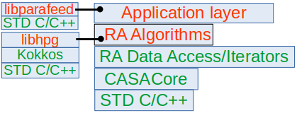
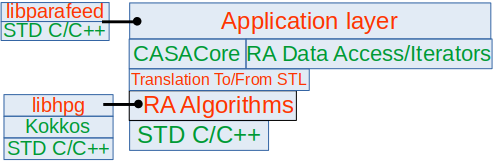

# LibRA


## Description

The primary goal of the LibRA project is to directly expose algorithms
used in Radio Astronomy (RA) for image reconstruction from
interferometric telescopes.  The primary target users are research
groups (R&D groups at observatories, at university departments) and
individual researchers (faculty, students, post-docs) who may benefit
from a software system with production-quality implementation of the
core algorithms which are also easy to use, deploy locally and modify
as necessary.  Therefore, a strong requirement driving this work is
to keep the interface simple, the software stack shallow and the software
dependency graph small.

This repository contains _only_ the
algorithmically-necessary code, and a build system to compile it into
a library of algorithms.  Such a library can be directly used as a
third-party library by others in the RA community.  Interfaces are
provided to access the algorithms from C++ and Python, or as an
end-user via [standalone applications](#currently-available-apps) to conveniently
configure and execute the algorithms from a Linux shell.  The
low-level algorithms exposed by these interfaces are factorized to be
used as components in a higher-level _generalized_ [Algorithm
Architecture](doc/AlgoArch/README.md).

Interferometric radio telescopes are indirect imaging devices which
collect data in the Fourier domain. Transforming the raw data from
such devices to images require application of sophisticated
algorithms to reconstruct the image.  The fundamental scientific
principles behind such telescopes share commonalities with other domains
that rely on indirect imaging such as Magnetic Resonance Imaging (MRI)
and Ultrasound imaging.  To make RA algorithms available for
application in such fields and enable cross-discipline R&D, the API to
the library is based on C++ STL for portability and wider use that
does not required RA-specific software stack and dependencies.

### Recent results

**[Deep Imaging at a National Scale](https://science.nrao.edu/enews/17.3/index.shtml#deepimaging)** : Using the set of [LibRA apps](#currently-available-apps) as path-finder for ngVLA-scale processing, we deployed the computationally intensive components of the [Algorithm Architecture](doc/AlgoArch/README.md) (paper in preparation) on a scale about 10x larger (O(100) GPUs) than what has been attempted so far at NRAO (O(10) GPUs) to investigate the operational and computational challenges of distributed computing at this scale. For this, in collaboration with the Center for High Throughput Computing (CHTC, Univ. of Wisconsin-Madison, WI), we used a nation-wide network of computers in the [Open Science Pool (OSPool)](https://osg-htc.org/services/open_science_pool.html), [U.S. National Science Foundation's Pathways for Advancing Throughput computing (PATh)](https://path-cc.io/), [San Diego Supercomputer Center (SDSC)](https://www.sdsc.edu/) at the Univ. of California San Diego and the [National Research Platform (NRP)](https://nationalresearchplatform.org/).  **This produced the [deepest image ever made with the VLA](https://science.nrao.edu/enews/17.3/images/HUDF_SBand_3.png), and in the RA community world-wide of the Hubble Ultra-Deep Field (HUDF) achieving a noise floor of 1 microJy/beam in the radio band.**


### The repository contains

- [ ] scientific code of algorithms for data calibration and image reconstruction
- [ ] a suite of [standalone applications (apps)](#currently-available-apps) to configure and trigger the algorithms from commandline, and
- [ ] a build system to build the library of algorithms, the [apps](#currently-available-apps), and all the dependencies other than the [System Requirements](#system-requirements).


A containerized means of building the LibRA project is available
[here](https://gitlab.nrao.edu/ardg/libra-containers).  This is mirrored [here](https://github.com/ARDG-NRAO/libra-containers).


The `main` branch of this project is also mirrored [here](https://github.com/ARDG-NRAO/LibRA).

### The LibRA software stack

The `src` directory contains the implementation of the basic
calibration and imaging algorithms.  The code has been derived from
the CASA project but contains _only_ the algorithmically-significant
part of the _much_ larger CASA code base.  The code here can be
compiled into a standalone reusable software library.  This
significantly simplifies the software stack and the resulting software
dependency graph (compared to the [CASA software stack and
dependencies](doc/figures/RRStack-CASA-Corrected-Modified.png)). A suite of
[standalone applications](#currently-available-apps) are
also available which can be built as relocatable Linux executable
(this may also be possible for MacOS, but we haven't test it).

The resulting software stack is shown below.  Figure on the left/top shows
our current software stack where the RA Algorithms layer is built on
the RA-specific data-access and CASACore layers.  _Work is in
progress to decouple the RA Algorithms layer from RA-specific layers
with the algorithms API based _only_ on the C++ Standard Template
Library (STL)_.  With a translation layer RA-specific libraries
(CASACore, RA Data Access/Iterators) may be replaced for use of RA
Algorithms in other domains.

| Current Stack | Target Stack |
| :----:         | :----:        |
|  | 

[`libparafeed`](https://github.com/sanbee/parafeed.git) in the figures is a standalone library for embedded user interface used for command-line configuration of LibRA apps.  

[`libhpg`](https://gitlab.nrao.edu/mpokorny/hpg.git) is a standalone library that deploys the compute-intensive calculations for imaging on a GPU or a CPU core (like the re-sampling of irregular data to and from a regular grid -- a.k.a. "gridding" and "degridding" in RA jargon).  This library is built on the [`Kokkos`](https://github.com/kokkos/kokkos.git) framework for performance portable implementation.

### Standalone Applications (apps)
Standalone applications (apps) give access to algorithms via commandline options in the `NAME=Val0[,Val1,...]` format, or via an embedded interactive user interface.  More detailed documentation for the user interfaces can be found via the following links:
- [ ] [Full User Manual](https://github.com/sanbee/parafeed/blob/wiki/UserDoc.md)
- [ ] [Commands in interactive mode](https://github.com/sanbee/parafeed/blob/wiki/UserDoc.md#user-commands)
- [ ] [Non-interactive mode (the `help` keyword setting)](https://github.com/sanbee/parafeed/blob/wiki/UserDoc.md#the-help-keyword)
- [ ] [Customization](https://github.com/sanbee/parafeed/blob/wiki/UserDoc.md#customization)

#### Currently available Apps
- [ ] [`roadrunner`](apps/src) : An application to transform the data in a Measurement Set (MS) to an image.  This can be deployed on a single CPU core, or on a GPU.  This is a.k.a. as the `major cycle` in RA.
- [ ] [`acme`](apps/src) : An application to apply normalization to the `weight`, `psf`, `residual` and `model` images created with `roadrunner` and `hummbee`, and compute the primary beam.
- [ ] [`hummbee`](apps/src) : An application to derive a model of the signal in the raw image (e.g., made using `roadrunner`).  This is a.k.a. the `minor cycle` in RA.
- [ ] [`coyote`](apps/src) : An application to build the CF Cache used as input to the `roadrunner` application.

- [ ] [`libra_htclean.sh`](frameworks/htclean) : A script that implements the [Algorithm Architecture](doc/AlgoArch/README.md) and uses the [apps](#currently-available-apps) as algorithmic components for imaging.  This implements the iterative image reconstruction technique widely used in RA for derivative and model update calculations (the `major cycle` and `minor cycle` respectively).  The execution graph can be deployed as a DAG on a CPU, a GPU, or on a cluster of CPUs/GPUs using the framework in `template_PATh`.  This has been used to deploy the parallel imaging execution graph on a local cluster, and on the [PATh](https://path-cc.io/about/) and [OSG](https://osg-htc.org/) clusters.  A variant that uses LibRA [apps](#currently-available-apps) as components has also been used for a prototype deployment on AWS.

- [ ] [`tableinfo`](apps/src) : An application to print summary of the data (MS) and images (information from image headers).
- [ ] [`mssplit`](apps/src) : An application to split a data (in the MS format) along various axis of the data domain.  The resulting data can be written as a deep-copy, or as a reference to the input data base.
- [ ] [`subms`](apps/src) : Functionally the same as `mssplit` but additionally re-normalizes the sub-tables in the resulting data base.

## System requirements
The following come default with RHEL8 or similar systems:

- [ ] GCC 8.x or later
- [ ] cmake 3.x or later
- [ ] git 2.0 or later, gcc-gfortran gtest-devel ccache
      
The `ccache` dependency can be dropped by setting `-DUseCcache=0` in the `casacore-cmake` target in `makefile.libra`.

The following list of packages need to be installed. Following is a typical command to install:

- [ ] ```dnf -y install {readline,ncurses,blas,lapack,cfitsio,fftw,wcslib,gsl}-devel ```

If `LIBRA_USE_LIBSAKURA=ON` also install Eigen3 library:
- [ ] ```dnf -y install eigen3-devel ```

- [ ] An installation of the appropriate version of CUDA is also required for GPU support in the ```roadrunner``` app.  This dependence is limited to the ```Kokkos``` and ```HPG``` libraries below. We used the following commands to install CUDA libraries for cross compilation. Your mileage may vary.  _Note that for only building the software, an actual GPU on the build-host is not necessary._
      
      export distro=rhel8
      export arch=x86_64
      sudo dnf config-manager --add-repo https://developer.download.nvidia.com/compute/cuda/repos/$distro/$arch/cuda-$distro.repo
      sudo dnf clean expire-cache
      sudo dnf module install nvidia-driver:latest-dkms
      
## Getting started

A clone of this repository will get the ```src``` directory with the scientific code (implementation of the RA algorithms), ```apps/src``` directory with the source code for the standalone application and the top level ```CMakeLists.txt``` file to compile the code including build time dependencies.

See [CUDA GPUs -- Compute Capability](https://developer.nvidia.com/cuda-gpus) page for details of NVIDIA GPUs to determine the value for the `Kokkos_CUDA_ARCH_NAME`.

```
git clone https://github.com/ARDG-NRAO/LibRA.git
cd LibRA
mkdir build 
cd build
# A list of Kokkos CUDA ARCH_NAME can be found at Kokkos web page https://kokkos.github.io/kokkos-core-wiki/keywords.html#keywords-arch
# See also CUDA GPUs -- Compute Capability at https://developer.nvidia.com/cuda-gpus.
# Default behaviour is to determined CUDA ARCH automatically.  
#
# Default behaviour is Apps_BUILD_TESTS=OFF
cmake -DKokkos_CUDA_ARCH_NAME=<ARCH_NAME> -DApps_BUILD_TESTS=OFF .. # The tests are built when the flag is turned on
# It is set to run "make -j NCORES" internally, so it is important to just run "make" below to prevent parallelizing make twice. 
make
```

The binary [standalone
applications](#currently-available-apps) will be installed
in ```libra/install/bin``` directory.

### Makefile Based Building

Below are the instructions for the older build system based on `makefile.libra`.  This can still be used, but we recommend using the `cmake` based build system with the instructions above.

A clone of this repository will get the ```src``` directory with the scientific code (implementation of the RA algorithms), ```apps/src``` directory with the source code for the standalone application and the ```makefile.libra``` file to compile this code and for download and building all other dependencies.  For now, follow the following sequence of commands to clone and build the system:

```
git clone https://github.com/ARDG-NRAO/LibRA.git
cd LibRA
make -f makefile.libra init
make -f makefile.libra allclone
make Kokkos_CUDA_ARCH=<ARCH_NAME from Kokkos web page https://kokkos.github.io/kokkos-core-wiki/keywords.html#keywords-arch> -f makefile.libra allbuild
# E.g., the following command to build with support for AMPERE family of NVIDIA GPUs at CUDA Capability 80
# make Kokkos_CUDA_ARCH=Kokkos_ARCH_AMPERE80 -f makefile.libra allbuild
```

The binary [standalone
applications](#currently-available-apps) will be install
in ```libra/install/linux_64b/bin``` directory.

##### Setting up the various variables in `makefile.libra`

- [ ] `Kokkos_CUDA_ARCH`: This is set via the commandline as `Kokkos_CUDA_ARCH=<CUDA ARCH>`.  
                          Set it to the value appropriate for the CUDA architecture of the GPU used with the `ftm=awphpg` setting of the `roadrunner` app.  
                          See list of supported values at the [Kokkos web page](https://kokkos.github.io/kokkos-core-wiki/keywords.html#keywords-arch).
- [ ] `CASA_BUILD_TYPE`, `CASACORE_BUILD_TYPE`: The `cmake` build-type setting for CASA and CASACore code.
- [ ] `{CASA,FFTW,KOKKOS,HPG,PARAFEED}_VERSION`: Names of the specific version or branch for the various packages.
- [ ] `{CASA,CASACORE_DATA,FFTW,KOKKOS,HPG,PARAFEED,SAKURA}_REPOS`: URL for the repository of the various packages.
- [ ] `PATH`: Set this to include the location of the local CUDA installation.  To build the `LibRA` system a GPU is not necessary, but a CUDA install is necessary.
- [ ] `NCORES`: The number of CPU cores used for compiling.  It is used as `make -j ${NCORES}` in the various `build` targets.
- [ ] `Apps_BUILD_TESTS`: Whether to build apps unit tests. Default is `OFF`. If it is set to `ON`, run the following to run unit tests locally.

```
cd LibRA/apps/src/tests
./../../../build/Libra/apps/src/tests/LibRATests
```

## Resources
- [ ] The [LibRA Singularity Container](https://gitlab.nrao.edu/ardg/libra-containers).
This is mirrored [here](https://github.com/ARDG-NRAO/libra-containers).

## ToDo List
- [ ] An app for (self-) calibration
- [ ] ~~Make a top-level `cmake` file.~~
- [ ] ~~A simple framework to run `coyote` on multiple cores/nodes for `mode=fillcf` setting.~~ 
A `slurm` based framework is in place.  [GNU Parallel](https://www.gnu.org/software/parallel) based one may also be useful.
- [ ] Implement a `mode` in `coyote` app to list the specific CFs from the CFC which would be required for the given MS and settings.   
Such a list can be used by other components of the algorithm
      architecture to make a potentially smaller sub-CFC, specially
      when the given MS is a partition of a larger database being
      imaged.

***
